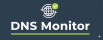

# Aghamon

A modern web dashboard for monitoring AdGuard Home DNS statistics, built with Go and Echo framework.



## 🚀 Features

- **📊 Real-time Statistics**: Monitor DNS queries, blocked domains, and client activity
- **👥 Client Management**: View connected DNS clients with detailed information
- **🌐 Upstream Performance**: Track DNS upstream response times and performance
- **🎨 Modern UI**: Clean, responsive interface with professional styling
- **🔒 Self-contained**: Single binary with embedded templates and assets
- **⚡ Fast & Lightweight**: Built with Go for high performance

## 📋 Dashboard Sections

### Home
- Overview dashboard with navigation cards
- Quick access to all monitoring sections

### Clients
- Connected DNS clients table
- Client IP addresses and hostnames
- WHOIS information (country, organization, city)
- Source detection (rDNS, WHOIS, etc/hosts)

### Statistics
- **Top Queried Domains**: Most frequently accessed domains
- **Top Clients**: Clients with highest query volumes
- **Top Blocked Domains**: Most frequently blocked domains
- **Summary Metrics**: Total queries, blocked queries, processing time

### Upstreams
- **Response Count**: DNS upstream servers by query volume
- **Response Time**: DNS upstream servers by average response time

## 🛠 Installation

### Prerequisites
- Go 1.24.3 or later
- AdGuard Home instance
- Basic authentication credentials for AdGuard Home API

### Building from Source

1. **Clone the repository**:
   ```bash
   git clone https://github.com/debuggerboy/aghamon.git
   cd aghamon
   ```

2. **Install dependencies**:
   ```bash
   go mod tidy
   ```

3. **Build the self-contained binary**:
   ```bash
   go build -o aghamon
   ```

### Configuration

Create a `config.yaml` file in the same directory as the binary:

```yaml
# AdGuard Home Configuration
adguard:
  # Your AdGuard Home server URL
  server_url: "https://your-adguard-server.com"
  # AdGuard Home username
  username: "your-username"
  # AdGuard Home password
  password: "your-password"
```

### Running the Application

```bash
./aghamon
```

The application will start on `http://localhost:8080`

## 🔧 Configuration Options

### Environment Variables (Optional)
- `PORT`: Change the default port (default: 8080)
- `CONFIG_PATH`: Path to config file (default: ./config.yaml)

### AdGuard Home API Requirements
- AdGuard Home admin interface access
- Basic authentication enabled
- API endpoints accessible from the monitoring server

## 🏗 Architecture

### Technology Stack
- **Backend**: Go 1.24.3 with Echo web framework
- **Templates**: HTML with embedded Go templates
- **Styling**: Pure CSS with Flexbox layout
- **Assets**: Embedded file system for self-contained deployment

### Key Components
- **Embedded File System**: Templates and assets compiled into binary
- **REST API Client**: AdGuard Home API integration
- **Template Engine**: Dynamic HTML generation
- **Static File Server**: Secure asset serving

## 📁 Project Structure

```
aghamon/
├── main.go                 # Main application entry point
├── config.yaml            # Configuration file (external)
├── go.mod                 # Go module dependencies
├── README.md              # This file
├── assets/                # Static assets (embedded in binary)
│   └── logo_small.png     # Application logo
└── templates/             # HTML templates (embedded in binary)
    └── base.html          # Base template with header/footer
```

## 🔒 Security Features

- **Secure Static File Serving**: Assets served only from dedicated directory
- **Path Traversal Protection**: Prevents directory traversal attacks
- **Embedded Resources**: Templates and assets compiled into binary
- **Configuration Isolation**: Sensitive config stored externally

## 🌐 API Endpoints

### Application Routes
- `GET /` - Home dashboard
- `GET /clients` - DNS clients table
- `GET /stats` - DNS statistics
- `GET /upstreams` - DNS upstream performance

### AdGuard Home API Integration
- `GET /control/clients` - Fetch client information
- `GET /control/stats` - Fetch DNS statistics

## 🚀 Deployment

### Single Server Deployment
1. Build the binary: `go build -o aghamon`
2. Create configuration file: `config.yaml`
3. Run: `./aghamon`

### Docker Deployment (Example)
```dockerfile
FROM golang:1.24-alpine AS builder
WORKDIR /app
COPY . .
RUN go build -o aghamon

FROM alpine:latest
WORKDIR /root/
COPY --from=builder /app/aghamon .
COPY config.yaml .
EXPOSE 8080
CMD ["./aghamon"]
```

## 🔍 Monitoring & Logging

The application provides built-in logging:
- Server startup and shutdown events
- API request errors
- Configuration loading status

## 🤝 Contributing

1. Fork the repository
2. Create a feature branch: `git checkout -b feature/new-feature`
3. Commit changes: `git commit -am 'Add new feature'`
4. Push to the branch: `git push origin feature/new-feature`
5. Submit a pull request

## 📄 License

This project is licensed under the MIT License - see the LICENSE file for details.

## 🙏 Acknowledgments

- [Echo Framework](https://echo.labstack.com/) - High performance Go web framework
- [AdGuard Home](https://github.com/AdguardTeam/AdGuardHome) - Network-wide ads & trackers blocking DNS server
- Go Embed Package - For self-contained binary deployment

## 📞 Support

For issues and questions:
1. Check the [AdGuard Home API documentation](https://github.com/AdguardTeam/AdGuardHome/wiki/API)
2. Review the configuration examples
3. Create an issue in the GitHub repository
---

## 👨‍💻 Author

Contact Us:
- [debuggerboy - Github](https://github.com/debuggerboy)
- [Pulsiot - Github](https://github.com/pulsiot)
- [Pulsiot - organization](https://pulsiot.com/)
- [debuggerboy - organization](https://share.google/mdae1X48J9zRssTUA)

---

**Made with ❤️ using Go**
